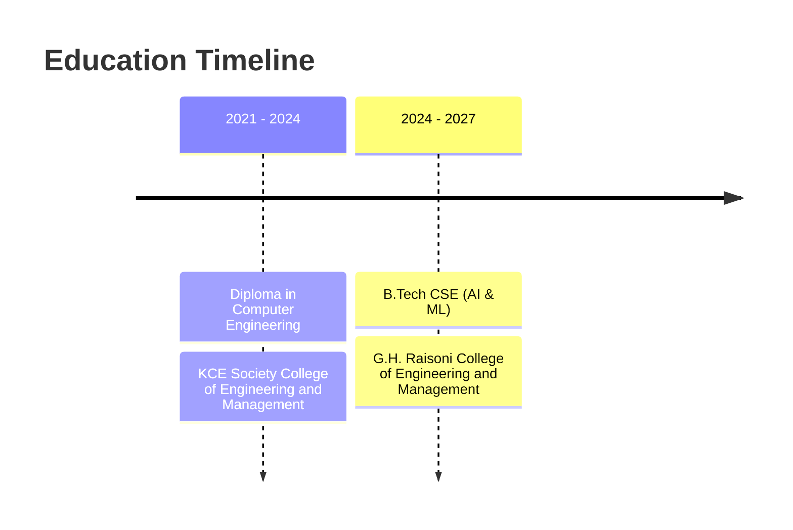

 

  

  

 

---

 

## About Me

I'm a B.Tech Computer Science student specializing in AI & ML, and I spend most of my time building native Android apps in Kotlin and Jetpack Compose.

I care about how an app is put together, not just whether it works — clean separation between UI, ViewModel, and repository layers, offline-first data with Room, and Firebase for auth, sync, and storage. Recent projects have pushed me into AI-assisted features (receipt scanning, natural-language expense entry, spending insights), which is where my Android and AI/ML interests meet.

Currently exploring: Hilt-based dependency injection, testing Compose UI, and structuring MVI where it earns its complexity over MVVM.

Looking for an Android Developer role where I can keep building real, production-shaped apps.

 

---

 

## Education

**B.Tech in Computer Science & Engineering (AI & ML)**
 
G.H. Raisoni College of Engineering and Management, Jalgaon — Aug 2024 to Jul 2027
 
CGPA: 9.06

**Diploma in Computer Engineering**
 
KCE Society College of Engineering and Management, Jalgaon — Sep 2021 to Jun 2024
 
Percentage: 82.69%

 

---

 

## Certifications

- Android Development
- Kotlin
- Figma
- Firebase

 

---

 

## Achievements

- Participated in hackathons
- Regularly solves DSA problems

 

---

 

## Tech Stack

**Android**
  

 

**Architecture**
  

 

**Async & Data**
  

 

**Networking & Backend**
  

 

**DI & Tools**
  

 

**Cross-Platform**
  

 

---

 

## Featured Projects

<table width="100%">
<tr>
<td style="border:1px solid #1f6d4a; border-radius:8px; padding:20px;" valign="top">

### 📱 AI Expense Tracker

Personal-finance Android app with receipt scanning, AI category suggestions, budget tracking, and Firebase cloud sync.

 

 

**Architecture**
 
MVVM with a repository layer bridging Room, DataStore, and Firebase; domain layer for budgets, recurring rules, and export summaries.

**Notable**
 
Offline-first storage with cloud backup, AI-based receipt/expense extraction with an offline rule-based fallback, CSV/PDF export.

 

**[→ View repository](https://github.com/Hitesh-1501/AIExpenseTracker)**

</td>
</tr>
</table>

 

<table width="100%">
<tr>
<td style="border:1px solid #1f6d4a; border-radius:8px; padding:20px;" valign="top">

### 🛍️ TrenNex

Native Android shopping app with phone-auth, product browsing/search, cart & wishlist persistence, and map-based delivery addresses.

 

 

**Architecture**
 
Fragment-based MVVM with a repository layer for products, cart, and wishlist; ViewModels driving auth, search, and profile logic.

**Notable**
 
Phone OTP auth, reverse-geocoded delivery addresses saved per-user in Firestore, Firestore security rules included.

 

**[→ View repository](https://github.com/Hitesh-1501/Trennex-App)**

</td>
</tr>
</table>

 

<table width="100%">
<tr>
<td style="border:1px solid #1f6d4a; border-radius:8px; padding:20px;" valign="top">

### 🎨 TrenNex UI/UX Design

The UI/UX design system behind TrenNex — a modern, clean, interactive shopping-app design inspired by leading e-commerce platforms while keeping its own visual identity.

 

 

**Focus**
 
A minimal yet visually appealing design system and smooth user flow, built as the design counterpart to the TrenNex Android app.

 

**[→ View repository](https://github.com/Hitesh-1501/TrenNex-UI-UX)**

</td>
</tr>
</table>

 

> **PrepPilot** — an AI-powered mock-interview app (personalized feedback, weak-area analysis) is in active development and will be added here once its first stable build is public.

<!--
Add cards for these once one-line descriptions are provided, using the same bordered <table><td style="border:1px solid #1f6d4a; border-radius:8px; padding:20px;"> pattern above:
- Elevate-AI
- TrelloClone
- DailyScopeNewsApp
-->

 

---

 

## GitHub Stats

  

 

---

 

## Let's Connect

